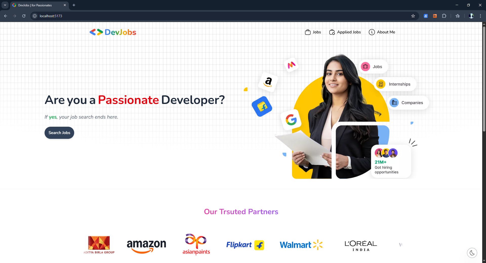

# 💼 DevJobs – Modern Job Listing Web App

DevJobs is a modern, fully responsive job listing platform built with **React** and **Redux**. It enables developers to find, apply, and manage job applications easily. The application is tailored to deliver a clean user experience across all devices, with features like **dark/light themes**, **real-time search**, **multi-criteria filtering**, and **framer-motion animations**.

---

## ✨ Features

### 🔹 Modern UI/UX
- Fully **responsive design** optimized for desktop, tablet, and mobile.
- **Intuitive navigation** with a custom animated hamburger menu on mobile.
- Built using **Tailwind CSS** for clean, consistent styling.
- **Framer Motion** for smooth, performance-optimized UI animations.

### 🌗 Dark & Light Theme
- Toggle between **dark and light modes**.
- Theme state is preserved across page navigations.

### 🔍 Smart Filtering & Sorting
- Filter jobs by **skills**, **location**, and **job title**.
- Sort listings by:
  - **Salary (High to Low)**
  - **Applicants (Low to High)**
- Real-time filter count with visual highlighting of active filters.

### 🧠 Search Bar
- Keyword-based search on job title.
- Instant refinement of job listings as you type.

### 💾 State Management with Redux
- Global state for job data, applied jobs, filters, and more.
- Modular Redux slices ensure scalability.

### 📑 Multi-step Job Application Form
- Collects personal details, experience, and additional info.
- Validates fields using **Yup** schema validation.
- Ensures users cannot proceed until required fields are filled.

### ✅ Application Confirmation
- Confirmation page with a unique **Job ID** after successful form submission.
- Option to return to job listings or view applied jobs.

### 🗃️ Applied Jobs Page
- Lists all jobs the user has applied to.
- Allows users to **edit** or **withdraw** applications.

---

## 🧱 Tech Stack

| Tech           | Purpose                             |
|----------------|-------------------------------------|
| **React**      | Frontend UI                         |
| **Redux**      | Global state management             |
| **Tailwind CSS** | Utility-first styling framework    |
| **Framer Motion** | Animations and transitions       |
| **Yup**        | Form validation                     |
| **React Router** | Client-side routing               |
| **LocalStorage** | State persistence for applications|

---

## 📷 Screenshots

| Light Theme                               | Dark Theme                                |
|-------------------------------------------|--------------------------------------------|
|    |     |

---

